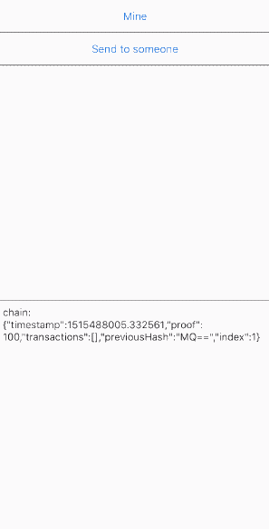

# BlockchainSwift

A simple Blockchain in Swift.

## What is this?

This is an implementation of Blockchain in Swift 4 based on **this great article** [^consensus]:

[Learn Blockchains by Building One – Hacker Noon](https://hackernoon.com/learn-blockchains-by-building-one-117428612f46)

[^consensus]: The "Consensus" part is available in [feature/consensus](https://github.com/shu223/BlockchainSwift/tree/feature/consensus) branch.

## How to build

- Open `BlockchainSwift.xcodeproj` with Xcode 9
- Build and Run!



## What is interesting?

Just seeing the sample app is NOT fun at all. Trying to implement by yourself according to the reference articles would be fun :)

The implementation is quite simple, **less than 200 lines**.

For example, Here is the `Block`:

```swift:Block.swift
struct Block: Codable {
    let index: Int
    let timestamp: Double
    let transactions: [Transaction]
    let proof: Int
    let previousHash: Data

    // Hashes a Block
    func hash() -> Data {
        let encoder = JSONEncoder()
        let data = try! encoder.encode(self)
        return data.sha256()
    }
}
```

Here are the articles:

- [Learn Blockchains by Building One – Hacker Noon](https://hackernoon.com/learn-blockchains-by-building-one-117428612f46)


日本語版（Python）:

- [ブロックチェーンを作ることで学ぶ 〜ブロックチェーンがどのように動いているのか学ぶ最速の方法は作ってみることだ〜](https://qiita.com/hidehiro98/items/841ece65d896aeaa8a2a)

日本語版（Swift）:

- [Swiftでブロックチェーンを実装してみる](https://qiita.com/shu223/items/ebe59325f36fbf25e3d6)